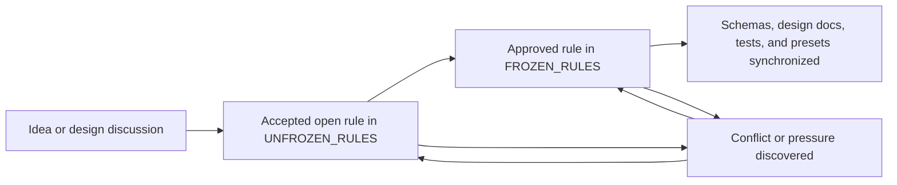

# Design Decision Index

This directory is the authoritative entry point for Server Repair TCG rule decisions. The active foundation now has two ledgers: approved rules and accepted open rules. This keeps implementation from silently deciding unresolved behavior without requiring every new process to read proposal and synchronization history.

## Current decision state

- [`FROZEN_RULES.md`](FROZEN_RULES.md) is the normative source implementations and tests may rely on.
- [`UNFROZEN_RULES.md`](UNFROZEN_RULES.md) is the canonical open inventory and is empty after the 2026-08-23 foundation-freeze approval.
- There are no active candidate decisions and no active unsynchronized decisions as of 2026-08-23.
- The former candidate ledger was fully resolved on 2026-08-22. The former synchronization ledger was fully resolved by [`TASK-007`](../../tasks/TASK-007-synchronize-approved-gameplay-rules.md) on 2026-08-23. Both retired ledgers remain available in Git history.
- `SCORE-001`, `GEN-001`, terminal policy, departure cleanup, Room lifecycle, and the four previously pressured frozen rules are approved. [`TASK-008`](../../tasks/TASK-008-freeze-first-version-foundation.md) records their synchronization.
- The repository has a frozen first-version gameplay foundation but no playable game engine yet.

## Reading order

1. Read this index for authority and lifecycle.
2. Read [`FROZEN_RULES.md`](FROZEN_RULES.md) for behavior implementation may rely on.
3. Check [`UNFROZEN_RULES.md`](UNFROZEN_RULES.md) for any question added after the current empty state.

## Active decision documents

| Document | Authority | Purpose |
| --- | --- | --- |
| [`FROZEN_RULES.md`](FROZEN_RULES.md) | Normative | Approved behavior that implementations and tests may rely on. |
| [`UNFROZEN_RULES.md`](UNFROZEN_RULES.md) | Non-normative open inventory | Future accepted unresolved rules and pressure; currently empty. |

Completed task records, case studies, candidate flows, examples, and Git history explain provenance but are not additional rule ledgers.

## Status definitions

- **Unfrozen:** An accepted rule question that must be resolved before affected behavior is implemented. New rule proposals enter this ledger directly and remain non-authoritative until approved.
- **Frozen:** An approved rule that remains authoritative until deliberately changed through the rules-version process.
- **Pressured:** A frozen rule contains an unresolved assumption or conflicts with a proposed resolution. The pressure is recorded in the unfrozen ledger; the existing frozen wording remains authoritative until the user approves an adjustment.
- **Synchronized:** The approved decision and every affected contract, schema, example, preset, test, and design document agree.

## Decision lifecycle

Rejected, derivative, or superseded ideas need not remain in the active foundation. Git history and the discussion or task that resolved them preserve their rationale.

## Foundation status

There is no remaining rule-decision order. New implementation may proceed in scoped tasks against the frozen contracts. If implementation exposes a genuine rules question or pressure, record it in `UNFROZEN_RULES.md` before embedding an answer in code, schema, content, or UI behavior.

## Maintenance rules

### Recording an open rule or pressure

1. Confirm the question changes game, authority, persistence, or information behavior rather than only content tuning or interface presentation.
2. Add it to `UNFROZEN_RULES.md` with the frozen rules and implementation surfaces it pressures.
3. Keep all options non-authoritative until the user approves one.

### Freezing a decision

1. Record the approved behavior in `FROZEN_RULES.md`.
2. Remove the corresponding question and pressure from `UNFROZEN_RULES.md`.
3. Update affected contracts, schemas, examples, presets, and tests.
4. Add migration and release notes when persisted or player-visible behavior changes.

### Handling synchronization work

1. State which frozen rule remains authoritative during migration.
2. Create a scoped task when multiple artifacts must change.
3. Add behavior-focused tests before relying on the new rule.
4. Close the task only after every affected source agrees. Do not recreate a permanent synchronization ledger merely to preserve completed history.
