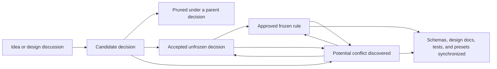

# Design Decision Index

This directory is the authoritative entry point for Server Repair TCG rule decisions. It separates approved rules, accepted open questions, new proposals, and synchronization problems so implementation does not silently resolve design questions.

## Current decision state

- The repository has approved match, Room, authority, visibility, first-version deck/turn/economy, Diagnosis, Isolation, Repair, Verify, Documentation, and closure-transaction rules, but no playable game engine yet.
- [`FROZEN_RULES.md`](FROZEN_RULES.md) remains authoritative while decisions are reviewed.
- [`UNFROZEN_RULES.md`](UNFROZEN_RULES.md) contains the remaining canonical open-rule inventory after the 2026-08-22 Candidate-Frozen Example Profile review.
- [`CANDIDATE_DECISIONS.md`](CANDIDATE_DECISIONS.md) now centers on verification-conditioned contribution scoring, the closure reward and Action cost, Equipment, Qualifications, and campaign Ticket selection.
- [`UNSYNCHRONIZED_DECISIONS.md`](UNSYNCHRONIZED_DECISIONS.md) records the migrations created by the newly frozen rules and the two candidate-flow assumptions explicitly rejected by the review.
- The immediate design goal is to resolve scoring and closure contention before implementing score or closure behavior. Equipment and Qualifications are the next independent preparation decisions.

## Reading order

1. Read this index for authority, status, and current priority.
2. Read [`FROZEN_RULES.md`](FROZEN_RULES.md) for behavior implementation may rely on.
3. Read [`UNSYNCHRONIZED_DECISIONS.md`](UNSYNCHRONIZED_DECISIONS.md) before relying on a frozen or unfrozen rule that may be under pressure.
4. Read [`UNFROZEN_RULES.md`](UNFROZEN_RULES.md) for accepted unresolved rules.
5. Read [`CANDIDATE_DECISIONS.md`](CANDIDATE_DECISIONS.md) for proposals still being organized or pruned.

## Decision documents

| Document | Authority | Purpose |
| --- | --- | --- |
| [`FROZEN_RULES.md`](FROZEN_RULES.md) | Normative | Approved behavior that implementations and tests may rely on. |
| [`UNFROZEN_RULES.md`](UNFROZEN_RULES.md) | Canonical open inventory | Fundamental questions accepted as real decisions but not yet resolved. |
| [`CANDIDATE_DECISIONS.md`](CANDIDATE_DECISIONS.md) | Staging | Proposed questions, dependencies, cross-stage questions, and pruned derivative ideas. |
| [`UNSYNCHRONIZED_DECISIONS.md`](UNSYNCHRONIZED_DECISIONS.md) | Reconciliation queue | Confirmed overlaps, likely future conflicts, and indirectly pressured frozen rules. |

## Status definitions

- **Candidate:** A proposed decision being tested for independence, scope, and conflicts.
- **Pruned:** A derivative idea retained beneath the more fundamental decision that controls it.
- **Unfrozen:** An accepted, fundamental rule question that must be resolved before affected behavior is implemented.
- **Frozen:** An approved rule that remains authoritative until explicitly changed.
- **Unsynchronized:** Two sources overlap, contradict, or depend on a foundation whose status changed. This status does not itself change rule authority.
- **Synchronized:** The decision and every affected contract, schema, example, preset, test, and design document agree.

## Decision lifecycle

Pruning preserves an idea and its rationale; it does not reject it permanently. A pruned idea may become independent later if resolving its parent does not determine it.

An unsynchronized entry identifies work to reconcile. Until an explicit decision changes a rule, the frozen rule remains authoritative.

## Recommended decision order for finishing the engine

Resolve reward ownership before balance values and preparation content:

1. [`SCORE-001`](CANDIDATE_DECISIONS.md#score-001) — whether verified causal contributions settle from a pending ledger.
2. [`SCORE-002`](CANDIDATE_DECISIONS.md#score-002) — the size and recipient of any closure reward.
3. [`DOC-009`](CANDIDATE_DECISIONS.md#doc-009) — whether the mandatory closure bundle costs zero Actions and needs any first-refusal rule.
4. Resolve score-threshold and terminal precedence in [`UNFROZEN_RULES.md`](UNFROZEN_RULES.md#7-terminal-conditions-and-results) against the resulting atomic score events.
5. [`EQP-001`](CANDIDATE_DECISIONS.md#eqp-001) — the separate pre-match Equipment slot and starting installation.
6. [`EQP-002`](CANDIDATE_DECISIONS.md#eqp-002) — permitted Equipment effects and their Action-cost budget.
7. [`EQP-003`](CANDIDATE_DECISIONS.md#eqp-003) — ownership, Room policy, and competitive equality.
8. [`QUAL-001`](CANDIDATE_DECISIONS.md#qual-001) — Qualifications as campaign progress rather than board power.
9. [`GEN-001`](CANDIDATE_DECISIONS.md#gen-001) — bounded campaign Ticket randomization.

After this batch, resolve the remaining production policy in `UNFROZEN_RULES.md`: configuration admission, timer precedence, Room lifecycle, computer players, statistics, and content-level balance.

## Maintenance rules

### Accepting a candidate

1. Confirm that the question is fundamental rather than an option controlled by another decision.
2. Record its dependencies and any frozen rules it pressures.
3. Move it to `UNFROZEN_RULES.md` without changing its decision ID.
4. Update the recommended order and synchronization queue.

### Freezing a decision

1. Record the explicit approved behavior in `FROZEN_RULES.md`.
2. Remove the corresponding question from `UNFROZEN_RULES.md`.
3. Identify affected contracts, schemas, examples, presets, and tests.
4. Complete or record the synchronization work.
5. Add migration and release notes when persisted or player-visible behavior changes.

### Resolving synchronization

1. State which source remains authoritative during the transition.
2. Resolve the most fundamental decision first.
3. Update dependent decisions and implementation artifacts.
4. Add behavior-focused tests before relying on the new rule.
5. Remove the active synchronization entry after every affected source agrees; Git history preserves the prior state.
