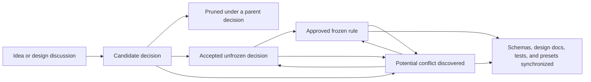

# Design Decision Index

This directory is the authoritative entry point for Server Repair TCG rule decisions. It separates approved rules, accepted open questions, new proposals, and synchronization problems so implementation does not silently resolve design questions.

## Current decision state

- The repository has approved match, Room, authority, visibility, and lifecycle rules, but no playable game engine yet.
- [`FROZEN_RULES.md`](FROZEN_RULES.md) remains authoritative while decisions are reviewed.
- [`UNFROZEN_RULES.md`](UNFROZEN_RULES.md) contains the existing canonical open-rule inventory. Its older entries have not yet been normalized into decision IDs.
- [`CANDIDATE_DECISIONS.md`](CANDIDATE_DECISIONS.md) contains the current engine-decision batch, centered on information visibility, the Diagnosis sub-lifecycle, Isolation, Documentation, Ticket closure, and card replenishment.
- [`UNSYNCHRONIZED_DECISIONS.md`](UNSYNCHRONIZED_DECISIONS.md) records confirmed overlaps and likely conflicts without silently changing either source.
- The current design goal is to resolve the engine-blocking decisions before reconciling older design documents, schemas, examples, or presets.

## Reading order

1. Read this index for authority, status, and current priority.
2. Read [`FROZEN_RULES.md`](FROZEN_RULES.md) for behavior implementation may rely on.
3. Read [`UNSYNCHRONIZED_DECISIONS.md`](UNSYNCHRONIZED_DECISIONS.md) before relying on a frozen or unfrozen rule that may be under pressure.
4. Read [`UNFROZEN_RULES.md`](UNFROZEN_RULES.md) for accepted unresolved rules.
5. Read [`CANDIDATE_DECISIONS.md`](CANDIDATE_DECISIONS.md) for proposals still being organized or pruned.

## Decision documents

| Document | Authority | Purpose |
| --- | --- | --- |
| [`FROZEN_RULES.md`](FROZEN_RULES.md) | Normative | Approved behavior that implementations and tests may rely on. |
| [`UNFROZEN_RULES.md`](UNFROZEN_RULES.md) | Canonical open inventory | Fundamental questions accepted as real decisions but not yet resolved. |
| [`CANDIDATE_DECISIONS.md`](CANDIDATE_DECISIONS.md) | Staging | Proposed questions, dependencies, cross-stage questions, and pruned derivative ideas. |
| [`UNSYNCHRONIZED_DECISIONS.md`](UNSYNCHRONIZED_DECISIONS.md) | Reconciliation queue | Confirmed overlaps, likely future conflicts, and indirectly pressured frozen rules. |

## Status definitions

- **Candidate:** A proposed decision being tested for independence, scope, and conflicts.
- **Pruned:** A derivative idea retained beneath the more fundamental decision that controls it.
- **Unfrozen:** An accepted, fundamental rule question that must be resolved before affected behavior is implemented.
- **Frozen:** An approved rule that remains authoritative until explicitly changed.
- **Unsynchronized:** Two sources overlap, contradict, or depend on a foundation whose status changed. This status does not itself change rule authority.
- **Synchronized:** The decision and every affected contract, schema, example, preset, test, and design document agree.

## Decision lifecycle

Pruning preserves an idea and its rationale; it does not reject it permanently. A pruned idea may become independent later if resolving its parent does not determine it.

An unsynchronized entry identifies work to reconcile. Until an explicit decision changes a rule, the frozen rule remains authoritative.

## Recommended decision order for finishing the engine

Resolve foundations before rewards and balance values:

1. [`OBS-001`](CANDIDATE_DECISIONS.md#obs-001) — visibility when an action or Evidence record is created.
2. [`HYP-001`](CANDIDATE_DECISIONS.md#hyp-001) — the candidate-fault universe for a Ticket.
3. [`ISO-001`](CANDIDATE_DECISIONS.md#iso-001) — the mechanical definition of Isolation.
4. [`CROSS-004`](CANDIDATE_DECISIONS.md#cross-004) — Diagnosis as a sub-lifecycle and its possible Repair gateway.
5. [`ISO-003`](CANDIDATE_DECISIONS.md#iso-003) — whether speculative Repair is legal as an exception to that gateway.
6. [`DOC-001`](CANDIDATE_DECISIONS.md#doc-001) — whether Documentation is required for closure.
7. [`DOC-002`](CANDIDATE_DECISIONS.md#doc-002) — whether actions are the primary Documentation targets and which attached records travel with them.
8. [`DOC-003`](CANDIDATE_DECISIONS.md#doc-003) — the visibility transition caused by Documentation.
9. [`DOC-004`](CANDIDATE_DECISIONS.md#doc-004), [`DOC-005`](CANDIDATE_DECISIONS.md#doc-005), and [`DOC-006`](CANDIDATE_DECISIONS.md#doc-006) — invocation, selection, and timing.
10. [`CROSS-001`](CANDIDATE_DECISIONS.md#cross-001) — the complete Ticket-closure transaction.
11. [`CROSS-002`](CANDIDATE_DECISIONS.md#cross-002) — the unified card-replenishment economy.
12. [`ISO-004`](CANDIDATE_DECISIONS.md#iso-004) and [`DOC-007`](CANDIDATE_DECISIONS.md#doc-007) — Root Cause and Documentation rewards.
13. [`TST-002`](CANDIDATE_DECISIONS.md#tst-002) and [`DOC-008`](CANDIDATE_DECISIONS.md#doc-008) — repeated Tests, event identity, and chronology.
14. [`CROSS-003`](CANDIDATE_DECISIONS.md#cross-003) — competitive and cooperative Documentation behavior.

After this batch, revisit the remaining engine questions already listed in `UNFROZEN_RULES.md`: turn phases, scoring, terminal precedence, targeting, ticket generation, computer players, and exhaustion.

## Maintenance rules

### Accepting a candidate

1. Confirm that the question is fundamental rather than an option controlled by another decision.
2. Record its dependencies and any frozen rules it pressures.
3. Move it to `UNFROZEN_RULES.md` without changing its decision ID.
4. Update the recommended order and synchronization queue.

### Freezing a decision

1. Record the explicit approved behavior in `FROZEN_RULES.md`.
2. Remove the corresponding question from `UNFROZEN_RULES.md`.
3. Identify affected contracts, schemas, examples, presets, and tests.
4. Complete or record the synchronization work.
5. Add migration and release notes when persisted or player-visible behavior changes.

### Resolving synchronization

1. State which source remains authoritative during the transition.
2. Resolve the most fundamental decision first.
3. Update dependent decisions and implementation artifacts.
4. Add behavior-focused tests before relying on the new rule.
5. Remove the active synchronization entry after every affected source agrees; Git history preserves the prior state.
