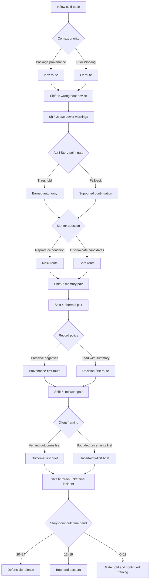

# The Quiet Cascade — campaign-one blueprint

Status: **versioned campaign content for Story pack `story.campaign.quiet_cascade.v1`**

## Campaign brief

*The Quiet Cascade* is a four-act, six-shift workplace mystery about what happens when ordinary technical faults pass through an organization that no longer carries enough context forward. The player begins the Continuity Rotation at Trinity Hub with an active legal response deck, no story-scoped Service Points, and no privileged knowledge of any machine. They finish by giving Civic Atlas and the floor a causal account that says exactly what the completed work established—and what it did not.

The expected first playthrough is roughly three to four hours: six finite local Matches containing twelve Tickets, separated by short scenes and four bounded remembered choices. All twelve currently supported causal fingerprints appear exactly once. This breadth is intentional: the story-scale pattern is not a fabricated common hardware cause. It is the accumulated institutional effect of treating different, individually ordinary problems as if one short status or one green result explained them all.

### Four acts

| Act | Shifts | Training progression | Emotional movement |
| --- | --- | --- | --- |
| I — Learn the Line | 1–2 | Public Symptoms and Candidates; corroborated Evidence; same warning with different actionable truth | Curiosity becomes accountability when the player's first closed work is reviewed outside First Look |
| II — Follow the Repeaters | 3–4 | Definitive versus corroborated routes; multiple Verify requirements; telemetry versus physical conditions | Mentor confidence becomes productive disagreement about reproducibility and discrimination |
| III — Read Between Worklogs | 5 | Physical link versus address configuration; source provenance and omitted negative results | Jonah and the player separate defending SIFT's value from defending every confident display |
| IV — Put the Truth in Service | 6 | Three-Ticket queue planning across boot and storage; Search/Refresh and exact response resources | The team replaces the desire for one dramatic culprit with a defensible account people can act on |

### Starting and ending state

At `story.qc01.entry`, the Player is a Crossline Technician from First Look beginning the Continuity Rotation. Story state starts with zero story-scoped Service Points and default remembered-choice values. Profile lifetime statistics are display-only and cannot change topology.

Every closed Ticket settles one Isolation and one necessary-Repair contribution, so the six reviewed Matches have a maximum campaign total of 24 story-scoped Service Points. The final gate always has a path:

- **Defensible release** — 20 or more points: the account is broad enough for a client-facing release and an internal corrective review.
- **Bounded account** — 12–19 points: the team reports what it proved, identifies material gaps, and keeps affected work under bounded review.
- **Gate hold and continued training** — fewer than 12 points: the campaign ends without shame or fabricated certainty; Gate retains the review and the rotation continues from documented gaps.

These are Story outcomes, not new engine result enums. No ending rewrites a Match, awards extra gameplay points, converts an abandonment to a closure, or claims a hidden shared cause.

## Meaningful bounded choices

| Choice ID | Options | Immediate effect | Remembered acknowledgment |
| --- | --- | --- | --- |
| `choice.qc01.intake_context` | `package_provenance` / `prior_worklog` | Inez or Ev leads the first context review | Gate later names which history the Player chose to carry first |
| `choice.qc01.mentor_question` | `reproduce_condition` / `discriminate_candidates` | Malik or Sora frames the next two shifts | Act II debrief credits the selected question without declaring the other unimportant |
| `choice.qc01.record_policy` | `preserve_negative_results` / `lead_with_summary` | Jonah and the Player choose how to present source coverage | The Act III debrief acknowledges whether source coverage or decision-readiness led the record |
| `choice.qc01.client_frame` | `verified_outcomes_first` / `bounded_uncertainty_first` | The order of the final client explanation changes | The selected ending preserves that rhetorical order while stating the same authorized facts |

All four choices reconverge. They change relationship texture, presentation order, and later acknowledgment, not Ticket truth, deck legality, score, or the configured Match.

## Human-readable graph

Each Match return first checks the accepted normalized outcome. A completed configured queue reaches its success scene; a partial or abandoned queue reaches a non-shaming gap scene. An interrupted active Match does not return: Story remains at its durable pre-Match checkpoint and offers a restart. Builder, content-version, or active-deck preflight failure also does not advance Story; the player receives a Decks/retry recovery route.

## Match plan

All six records use `first-version-v2`, `ticket-builder-v3`, the current TASK-014 immutable content pins, one cooperative human seat, a finite queue (`Q = 0`), no score termination (`X = -1`), two Actions per turn, three starting Search Tokens capped at five, one Refresh Token capped at one, and one Search Token after closure. The deck policy is `ACTIVE_PLAYER_DECK_PREFLIGHT`: runtime derives exact response counts from the active legal deck, runs complete-or-none Builder/solvability validation, persists the pre-Match Story checkpoint, and only then launches the ordinary Worker-authoritative Match.

`deck.core.multisystem_response_v3` is the committed proof fixture, not a forced loaner deck.

| Match reference | Seed | Ordered supported fingerprints | Exact response minimum | Reviewed generated snapshot digests |
| --- | --- | --- | --- | --- |
| `story.match.qc01.shift01.wrong_device` | `story.quiet_cascade.s01.v1` | `fingerprint.boot.incorrect_order` | Correct Boot Order ×1; Normal Boot Verification ×1 | `821769a6021482074d523c723dc08a6b9bd2885820eabe11a9011b199fc6dacb` |
| `story.match.qc01.shift02.power_lot` | `story.quiet_cascade.s02.v1` | `fingerprint.power.unseated_psu`, `fingerprint.power.failed_psu` | Reseat PSU ×1; Replace PSU ×1; Power Stability Verification ×2 | `c55b2fb6c7aee2644929ecdd803b3b3f5155b5ec4426b43e4953d0082391e0f7`; `8c7810616e535b8f62d3303e501bfcfdf8c9071df23903e2727b6fcb476e0d4b` |
| `story.match.qc01.shift03.memory_compare` | `story.quiet_cascade.s03.v1` | `fingerprint.memory.failed_dimm`, `fingerprint.memory.unseated_dimm` | Replace DIMM ×1; Reseat DIMM ×1; Full Memory Verification ×2; Memory Inventory Verification ×1 | `1bd3ccabc476313a0420cb9889ab5e7b84c60c250aa32f3d4f009f614f2c47e5`; `268c91a53ad795437e6690b2a5cc843071eea627671f2168b7a0dca00941a9c7` |
| `story.match.qc01.shift04.passes_cold` | `story.quiet_cascade.s04.v1` | `fingerprint.thermal.clogged_heatsink`, `fingerprint.thermal.failed_fan` | Replace Fan ×1; Clean Cooling Path ×1; Thermal Load Verification ×2 | `ce86a008060199c2f5c5cb2ed763385e8766315e35a2ce1b9b3e19fa39627a95`; `b8f877726a0d4356575d9efeb51c8226c674687ba0806ba067142ffc3f90c8cd` |
| `story.match.qc01.shift05.no_offer` | `story.quiet_cascade.s05.v1` | `fingerprint.network.incorrect_static_ip`, `fingerprint.network.failed_cable` | Correct Static IP ×1; Replace Network Cable ×1; Connectivity Verification ×2; Link Verification ×1 | `45f7e05c9d9a57f0e324c34d21dd1420d7c0f76ec0c4753b1494414a292697bd`; `4de1801512399068fea5881be79955af674ae35eff511d7a1d75101d6c0085d2` |
| `story.match.qc01.shift06.quiet_cascade` | `story.quiet_cascade.s06.v1` | `fingerprint.boot.missing_nvme`, `fingerprint.storage.failed_sas_member`, `fingerprint.storage.loose_cable` | Replace NVMe ×1; Reseat Storage Cable ×1; Replace RAID Member ×1; Storage Detection Verification ×2; Normal Boot Verification ×1; RAID Health Verification ×1 | `1c74ad0725e500ac01d4c356f17551fee11678a88b35ca5b591ff056a2efdff2`; `863ca5c0e0a72f9440e3352c80b070f4bde1ca166c801e79425821adfa7f4420`; `b06dc5a7d12c29af78edd71f7a82a611d971844e6e71863e142bc293f4e6af27` |

## Match-result boundary

Story consumes only the normalized player-safe fields approved by the Story runtime: `completion`, `valid`, `reason_codes`, `story_service_points_gained`, `tickets_closed`, `tickets_given_up`, `documented_outcome`, `verified_outcome`, and the five bounded contribution counts `tests_run`, `isolations_accepted`, `repairs_performed`, `verify_passes`, and `documentation_actions`. Its branch conditions use only the narrower allowlist in `matches.json`; raw reason codes and contribution counts remain presentation/reporting data in this campaign version.

The script never reads hidden Faults, unchosen outcomes, replay internals, private Evidence from another audience, raw client counters, or the Builder's author-only fingerprint selection. Client-safe preambles name workplace pressure, Symptoms, or subsystem context without naming the correct Candidate, required diagnostic, Repair, or branch.

## Content boundary

The current expanded catalog proves no TASK-014 failed-Verify/recovery fingerprint. The separate recovery tutorial is pinned to its own older tutorial catalog and response deck. Campaign prose may respect the general rule that failed Verify reopens Diagnosis, but these six Story Matches do not fake such an event or silently import the tutorial scenario under the active-deck policy.

No additional recurring character is required. The established ensemble covers Inflow, First Look, Rigline, Trace, Bench, Gate, Outflow, Client Programs, and Knowledge Systems. Background needs are registered in [`BACKGROUNDS.md`](../BACKGROUNDS.md).

## Generated proof and reports

The committed TASK-027 engine campaign completed all six configured queues with the canonical proof deck in 14, 93, 21, 29, 112, and 217 turns respectively. All six identical-input reruns matched Ticket snapshots, replay digests, outcomes, scores, and turn counts. Builder reconstruction matched all twelve pinned Ticket IDs and snapshot SHA-256 digests. The final three-Ticket proof is intentionally called out as a tight automated-policy case: 217 turns under a 220-turn cap. This is proof of current constructibility and completion, not a claim that a human route should take 217 turns or that the cap can safely be reduced without a new run.

The generated graph report records 324 reachable statements, 66 labels, 24 scenes, four choices, six Match nodes, 29 checkpoint IDs, no unreachable label, and no cycle. The 48-route matrix covers both options of every remembered choice, completed and abandoned return handling for all six Matches, and each of the three ending bands.

- Machine graph report: [`QUIET_CASCADE_GRAPH_REPORT.json`](../reports/QUIET_CASCADE_GRAPH_REPORT.json)
- Human graph report: [`QUIET_CASCADE_GRAPH_REPORT.md`](../reports/QUIET_CASCADE_GRAPH_REPORT.md)
- Ending-band editorial transcripts: [`QUIET_CASCADE_ROUTE_TRANSCRIPTS.md`](../reports/QUIET_CASCADE_ROUTE_TRANSCRIPTS.md)
- Automated engine artifacts: `automated_games/task-027-quiet-cascade-v1/`

`node src/story/generate-quiet-cascade-reports.mjs` reruns the expensive engine proof twice per Match and regenerates every report. `node src/story/generate-quiet-cascade-reports.mjs --reports-only` preserves the committed engine runs while deterministically rebuilding Builder pins, graph analysis, route coverage, and transcripts after source-copy review.
