# Gameplay reference images

This folder contains the approved **Night-Shift Operations Desk** visual references: one project-owner-supplied vanilla proof of concept and its screenshot establish the TASK-010 minimum implementation floor; three original AI-generated references establish the desktop, component, and mobile targets; later project-owner-supplied studies explore Relevant and Global Diagnostic Bench compositions; a three-image TASK-016 comparison set records the post-TASK-014 baseline beside refined Global and Relevant layout directions; and two TASK-020 targets refine the shared one-row Bench and spatial response hand. Together they communicate composition, material, illustration density, card family grammar, responsive hierarchy, catalog-density alternatives, and achievable browser-native depth.

They are not:

- canonical card or Ticket illustrations;
- exact UI copy or authoritative match fixtures;
- production implementation screenshots;
- proof that every pictured interaction is legal; or
- a substitute for `FROZEN_RULES.md`, schemas, engine projections, or TASK-010 acceptance tests.

The three generated target images received a rules-oriented visual QA pass. Visible Repair costs were corrected to the frozen 0/1/2 envelope, and Verify text that implied a Service Point award was removed. The minimum demo and all images still contain illustrative sample state and incidental text; implementation must render current pinned content and player-safe engine projections.

## 00 — Minimum implementation floor

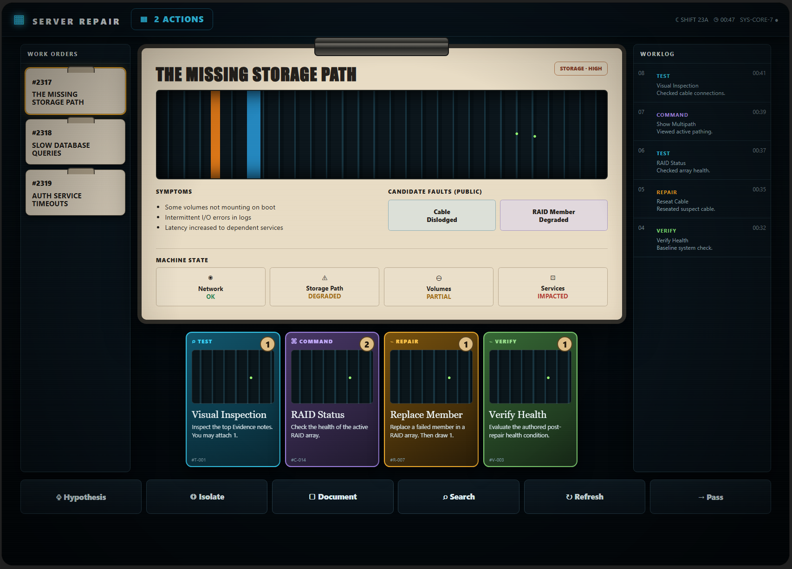

Source: [`ui-minimum-demo.html`](./ui-minimum-demo.html)

This standalone proof of concept uses HTML, CSS, and vanilla JavaScript with no external runtime library. Use it to establish the minimum acceptable execution quality for:

- layered graphite/navy panels and a tactile vellum Ticket;
- restrained pseudo-texture, directional lighting, shadow, glow, and depth;
- distinct Test, Command, Repair, and Verify Card families;
- slight perspective and hover tilt;
- native Web Animations feedback; and
- a responsive structural fallback.

The demo is visual implementation evidence, not production source or an authoritative fixture. Do not copy its hard-coded Ticket/Card text, costs, IDs, candidates, resources, Worklog, click-to-play behavior, or toast into the client. TASK-010 must use the canonical engine, Builder, content, Worker authority boundary, accessibility alternatives, and approved Anime.js policy. A completed board that is materially flatter or less polished than this floor does not meet TASK-010.

## 01 — Desktop board

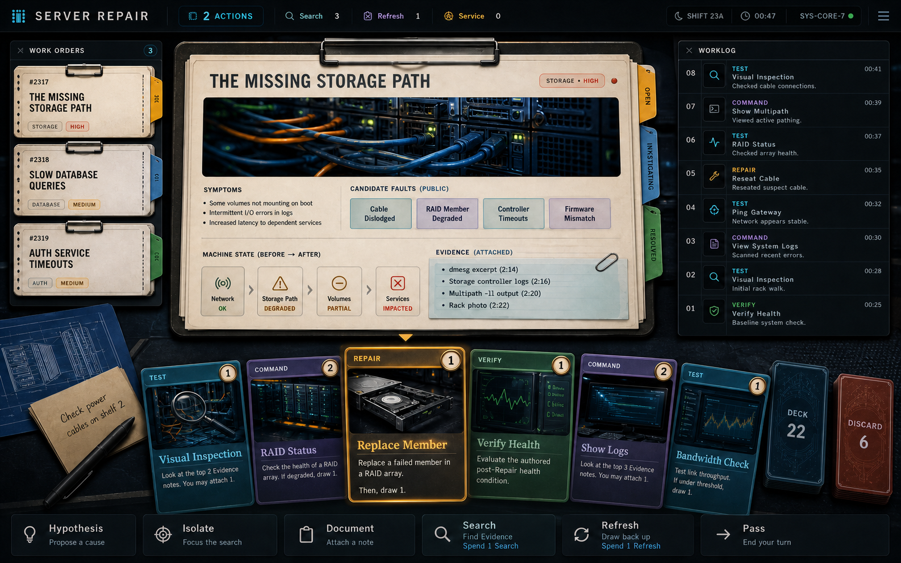

Use it for:

- full-width composition;
- Ticket-as-hero hierarchy;
- persistent desktop Worklog;
- tactile queue, Evidence, machine-state, card, deck, and discard differentiation;
- illustrated hand density; and
- basic actions presented as tools rather than cards.

Do not copy incidental card effects, candidate names, or ticket numbers from the pixels.

### Generation prompt

> Original high-fidelity 16:10 Server Repair gameplay board using supplied screenshots only as references for colorful composition, tactile texture, illustration-rich cards, selected-card inspection, and widescreen density. Create a night-shift operations desk with graphite/navy structure, vellum Ticket, warm lamp, cool rack light, left Ticket queue, central “THE MISSING STORAGE PATH,” right immutable Worklog, bottom illustrated hand, deck/discard, labeled basic-action rail, two Actions, Search, Refresh, and Service counters. Distinguish TEST cyan, COMMAND violet, REPAIR amber, and VERIFY emerald with word/icon/shape redundancy. No copied branding, fantasy combat, health bar, opponent lane, seven department lanes, hidden answer, wasted margins, trademark, or watermark.

Correction pass: change the pictured Repair cost from 3 to 1 and replace Verify reward language with “Evaluate the authored post-Repair health condition,” preserving the rest of the composition.

## 02 — Card and Ticket specimens

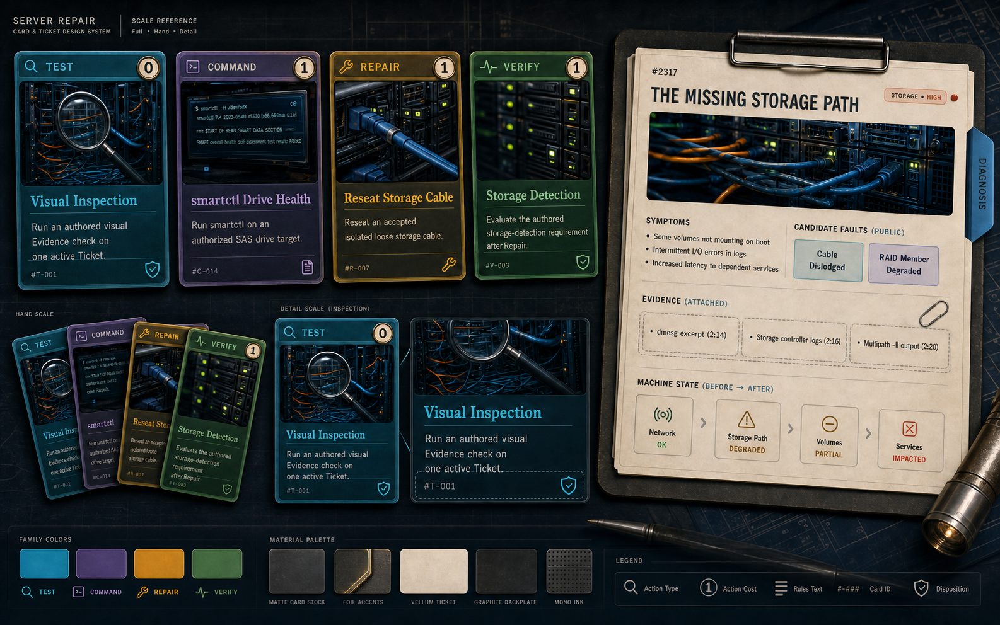

Use it for:

- full/hand/detail card scales;
- approximately 45% illustration area;
- family color, icon, word, and border redundancy;
- action-cost medallion placement;
- material and texture exploration; and
- making a landscape Repair Ticket categorically different from portrait playable cards.

### Generation prompt

> Original high-fidelity landscape component sheet photographed like a premium tabletop prototype on a dark drafting desk. Four full cards: TEST “Visual Inspection” cost 0, COMMAND “smartctl Drive Health” cost 1, REPAIR “Reseat Storage Cable” cost 1, VERIFY “Storage Detection” cost 1. Include fanned-hand and inspection scales. Add one large vellum Ticket “THE MISSING STORAGE PATH” with DIAGNOSIS tab, server-cable illustration, symptoms, public candidates, Evidence citations, and separate machine-state strip. Preserve the night-shift graphite/navy/parchment/cyan/violet/amber/emerald material language. No copied branding, combat, hidden truth, lifecycle lanes, illegal costs, trademarks, or watermark.

Correction pass: replace invented draw/reward microcopy with rules-faithful summaries:

- Visual Inspection: “Run an authored visual Evidence check on one active Ticket.”
- smartctl Drive Health: “Run smartctl on an authorized SAS drive target.”
- Reseat Storage Cable: “Reseat an accepted isolated loose storage cable.”
- Storage Detection: “Evaluate the authored storage-detection requirement after Repair.”

## 03 — Mobile board

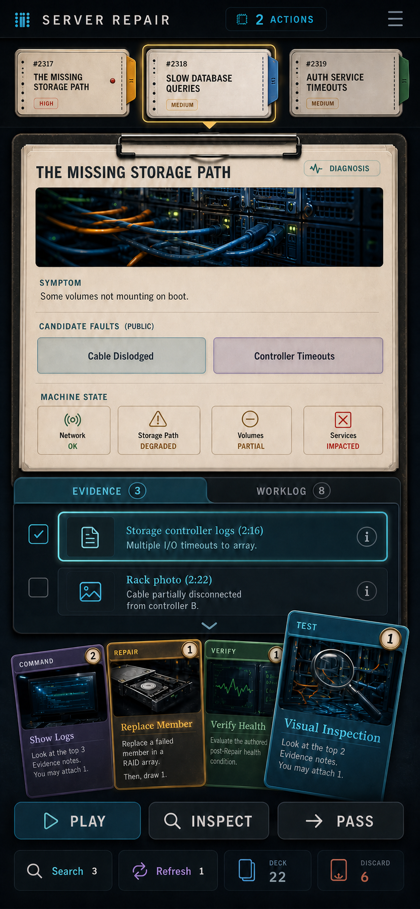

Use it for:

- genuine mobile recomposition rather than desktop scaling;
- horizontal Ticket strip;
- selected Ticket followed by an Evidence/Worklog sheet;
- citable Evidence rows with large touch targets;
- selected-card lift and sticky Play/Inspect/Pass tray; and
- explicit labeled Search, Refresh, deck, and discard counters.

### Generation prompt

> Original high-fidelity 390x844-class portrait solo gameplay UI using the desktop concept only as a style anchor. Compact “SERVER REPAIR” top rail and “2 ACTIONS”; horizontal strip of three illustrated Tickets; selected “THE MISSING STORAGE PATH” Ticket with DIAGNOSIS, server-cable art, symptom, public candidates, and machine state; segmented “EVIDENCE 3” / “WORKLOG 8” sheet with citable rows; bottom fanned illustrated hand; sticky PLAY, INSPECT, PASS actions; labeled Search 3, Refresh 1, deck, and discard counters. Tactile work-order paper on graphite glass, 44px-class controls, tap targeting primary. No squeezed desktop columns, tiny paragraphs, clipping, drag-only interaction, hidden answer, copied branding, trademark, or watermark.

Correction pass: change the pictured Repair cost from 3 to 1 and remove Verify Service reward language, preserving the rest of the portrait composition.

## 04 — Relevant Diagnostic Bench study

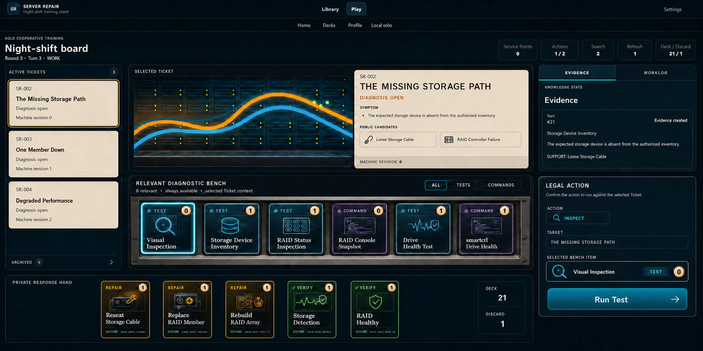

Use it for:

- a compact Ticket hero split between illustration and always-visible public details;
- a small public-context-filtered diagnostic shelf with All/Test/Command controls;
- strong separation between Bench diagnostics and the private Repair/Verify response hand;
- a complete selected-item Legal Action surface without internal scrolling;
- expanded Ticket-queue use of the available viewport; and
- a calm, low-friction teaching composition.

Do not treat the pictured six-item membership as authoritative or imply that a Relevant diagnostic is necessarily decisive. The engine/Builder projection owns membership, legality, cost, target, and result.

## 05 — Global Diagnostic Bench study

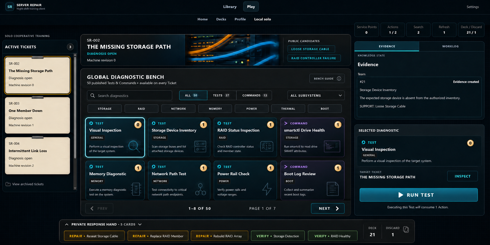

Use it for:

- a compressed selected-Ticket header that preserves candidates while prioritizing a large catalog;
- search, All/Test/Command counts, subsystem/category filters, bounded pagination, and result-range feedback;
- a persistent selected-diagnostic inspector with target, cost, and Run confirmation;
- a compact private response hand; and
- a deliberately denser expert-facing composition.

Symptoms remain primary observed information even when the reference compresses them. Production should retain a concise symptom or a one-step accessible full-Ticket view. The pictured `50` count is illustrative until all displayed knowledge records have complete playable contracts and outcomes. Global may include the same public-graph Relevant filter and `Why relevant?` paths as the focused view, while making clear that the curated graph is incomplete; it must never infer relevance from hidden truth.

## 06 — TASK-016 board-composition comparison

### Current post-TASK-014 baseline

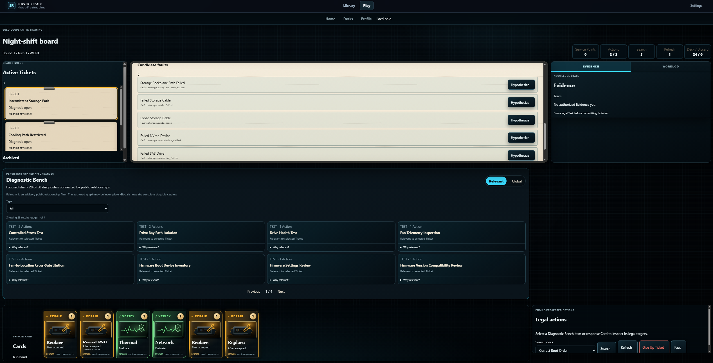

This capture documents the real starting point for TASK-016. It is not a visual target. Use it to verify that the refinement addresses:

- an oversized active-Match masthead and unused upper-board space;
- wide Candidate rows and other short controls consuming entire horizontal bands;
- a Bench and response hand stacked as broad blocks rather than composed with the queue and action rail;
- a shallow Ticket queue despite unused viewport height; and
- a Legal Action panel whose controls require scrolling.

### Refined Global direction

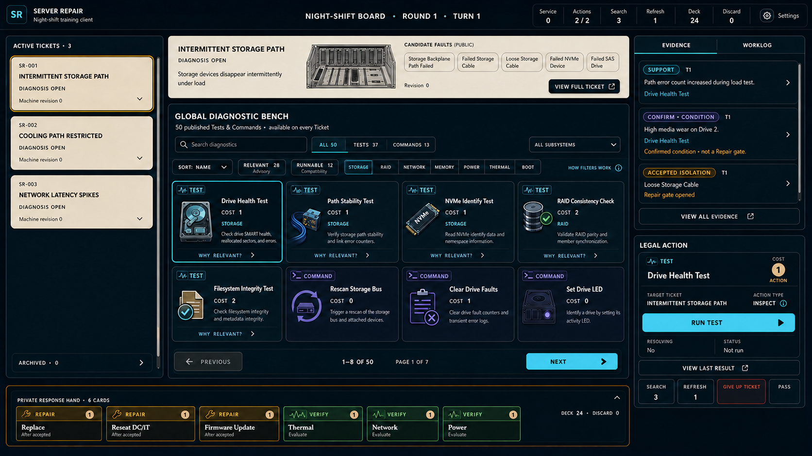

Use it for the Global mode's dense, searchable catalog; compact selected-Ticket header; taller queue; center-column response hand; and continuous right rail. The rail separates Evidence/Worklog, the context-sensitive Legal Action, and compact Basic Actions. Treat pictured content as incidental.

### Refined Relevant direction

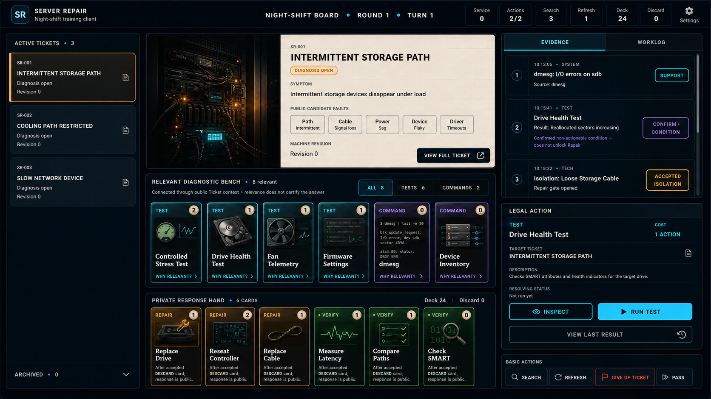

Use it for the Relevant mode's split Ticket summary, inline public Candidates, single diagnostic shelf, prominent full-Ticket route, taller queue, compact response hand, and distinct Legal Action and Basic Actions panels. Treat pictured content as incidental.

Across both directions, the profitable lesson is composition rather than gameplay: use horizontal adjacency for short related information, preserve one-step access to detail, and assign bounded overflow only to genuine collections. Do not copy names, counts, costs, outcomes, legality, or hidden-information assumptions from the pixels.

## 07 — TASK-016 post-pass review

### Relevant post-pass

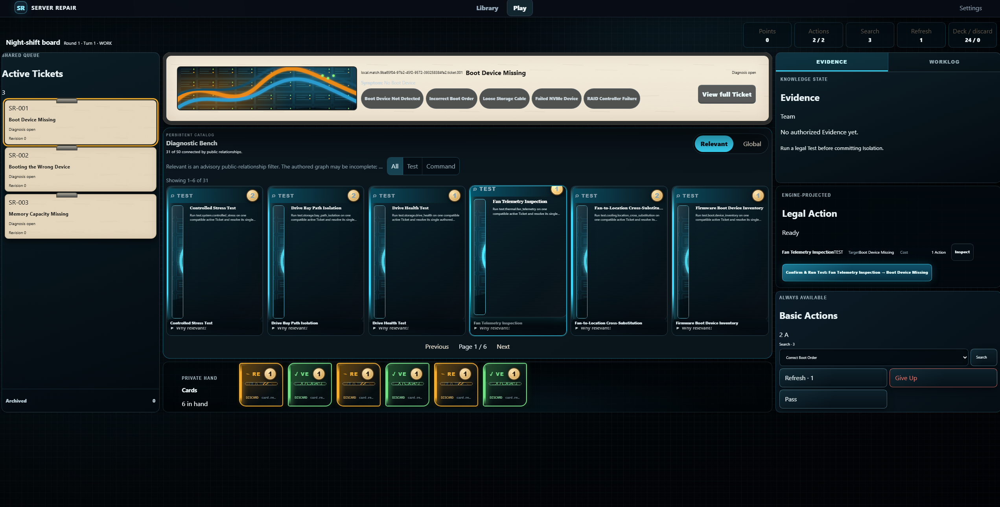

The pass successfully separates Basic Actions from Legal Action and establishes the queue/center/right-rail frame. It also demonstrates the follow-up defects TASK-018/TASK-019 must not normalize: over-compressed diagnostic art/text, unreadable hand-family/title anatomy, hidden relevance disclosure, pale symptom ink, and a large unused lower band.

### Global post-pass

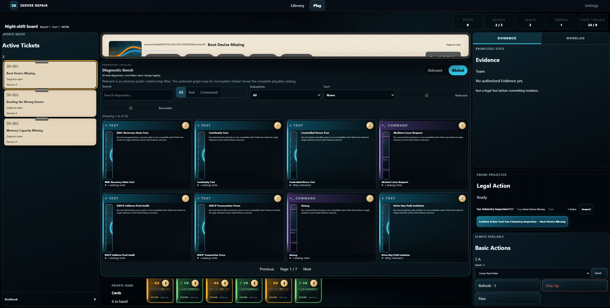

The pass gives the Ticket queue and right rail useful height, but the Global center rows clip nearly all selected-Ticket content and the hand's top edge. Diagnostic tiles devote substantial area to empty card bodies while squeezing art and text into a narrow strip. Container fit and absence of document scrolling did not guarantee usable descendants.

### Collapsed response-hand reference

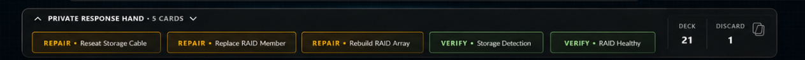

This is a compact anatomy reference for the UI-002 decision: a collapsed hand can preserve family, complete title, count, expansion control, and Deck/Discard state without pretending to be a full illustrated Card. It is not authoritative grouping, instance-selection, paging, or Card-disposition behavior.

The earlier `relevant_diagnostic_bench.png`, `task-016-relevant-bench-layout.png`, and `global_diagnostic_bench.png` remain the richer comparison targets. The fifth post-pass attachment was byte-identical to the existing `global_diagnostic_bench.png`, so it is not duplicated.

## 08 — TASK-020 one-row Bench and spatial-hand targets

### Global one-row direction

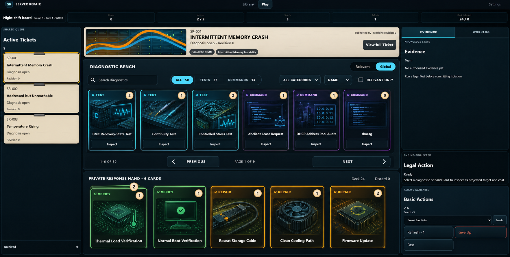

Use it for the approved proportional change: keep Global diagnostics to one readable row, accept additional pages, and give the private response hand enough height for illustrated family/title recognition. Its filter arrangement, six-column shelf, and five hand groups are useful examples, not fixed counts at every viewport.

### Relevant one-row direction

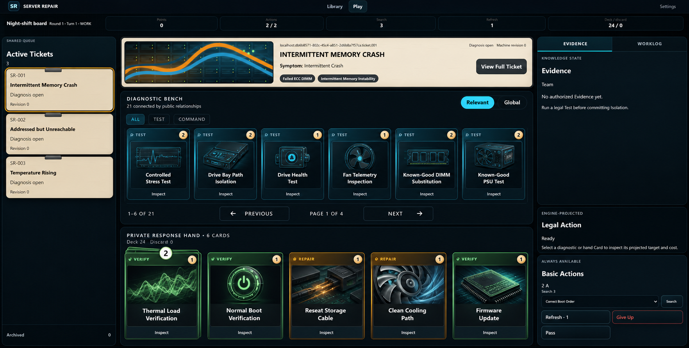

Use it for cross-mode parity: Relevant uses the same compact tile scale and one-row shelf as Global rather than doubling tile height. The duplicate Verify Cards illustrate a tactile layered stack with one quantity badge instead of persistent per-instance copy tabs. Underlying Card Instances remain authoritative and deterministic.

Both images are composition targets rather than gameplay fixtures. Do not copy their incidental Card/diagnostic membership, art, costs, quantities, Ticket facts, or filter results. The accepted deterministic TASK-019 captures are the before-state evidence; TASK-020 must compare measured row count, tile geometry, and hand allocation as well as visual comfort.

## Generation provenance

- Minimum reference provenance: project-owner-supplied standalone Server Repair HTML/CSS/JavaScript proof of concept and exact screenshot, added 2026-08-23. The source is committed only as a readable visual reference and is not part of the Viewer runtime.
- Diagnostic Bench reference provenance: two project-owner-supplied original layout studies, each 1774×887, added 2026-08-24. They are compositional references for PT-001 and TASK-016, not runtime assets or authoritative fixtures.
- TASK-016 comparison provenance: one project-owner-supplied post-TASK-014 Viewer capture (2535×1291) and two project-owner-supplied layout studies (1672×941), added 2026-08-25. They document a before/Global/Relevant composition comparison, not runtime assets or authoritative fixtures.
- TASK-016 post-pass provenance: two project-owner-supplied implementation captures (2543×1291 Relevant and 2551×1293 Global) plus one 1263×95 response-hand composition crop, added 2026-08-25. They are defect/interaction references for TASK-018/TASK-019, not runtime assets or gameplay fixtures. The accompanying modal recording is translated into deterministic reproduction steps in TASK-018 rather than committed as a large binary.
- TASK-020 target provenance: two project-owner-supplied 1764×892 one-row layout studies, added 2026-08-25. They define proportional and duplicate-stack direction for TASK-020, not exact content, breakpoint counts, or gameplay authority.
- Mode: built-in image generation, with targeted built-in edit passes.
- Date: 2026-08-23.
- Source references: four user-supplied screenshots used only for general layout/aesthetic lessons; not committed.
- Style anchor: the generated desktop board was used to maintain consistency in the specimen and mobile references.
- Redistribution boundary: the minimum proof of concept and three generated outputs are project references; no third-party screenshot or brand asset is included.
