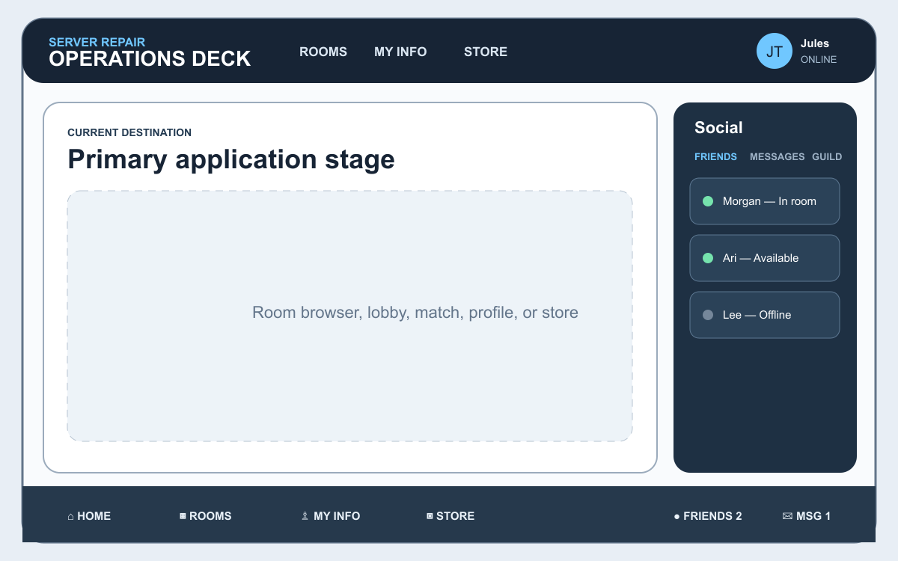
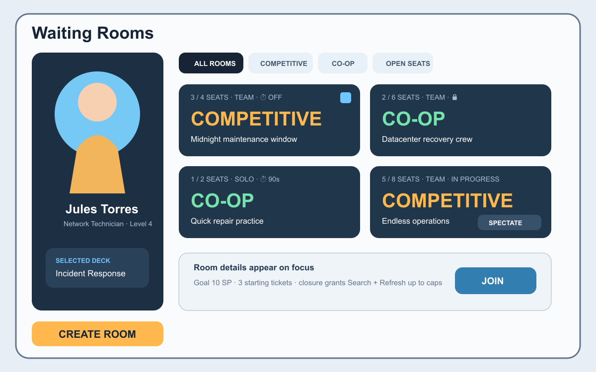
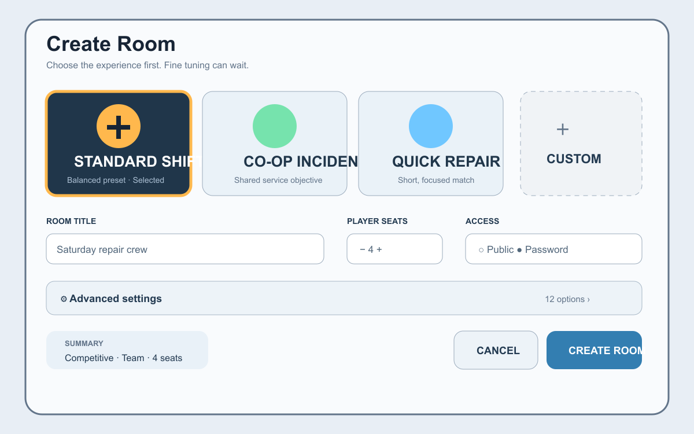
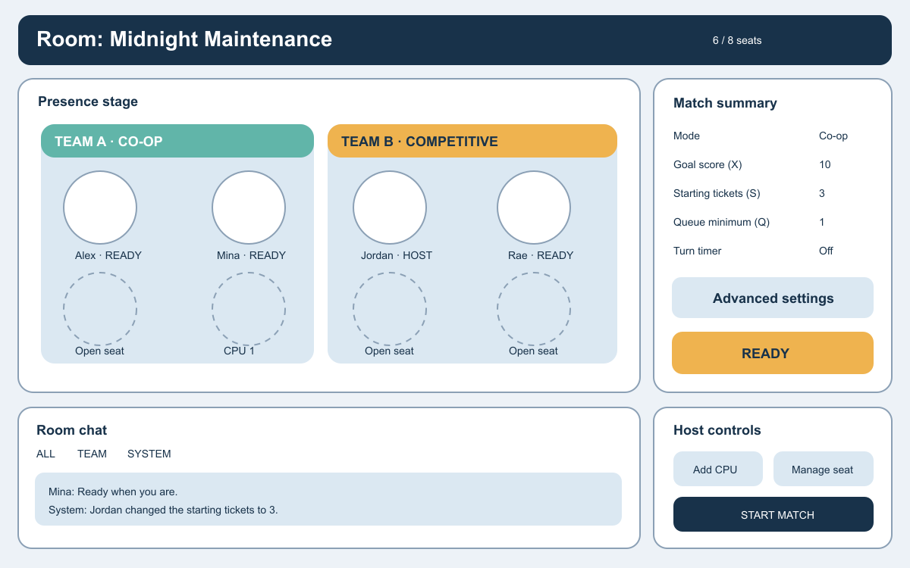
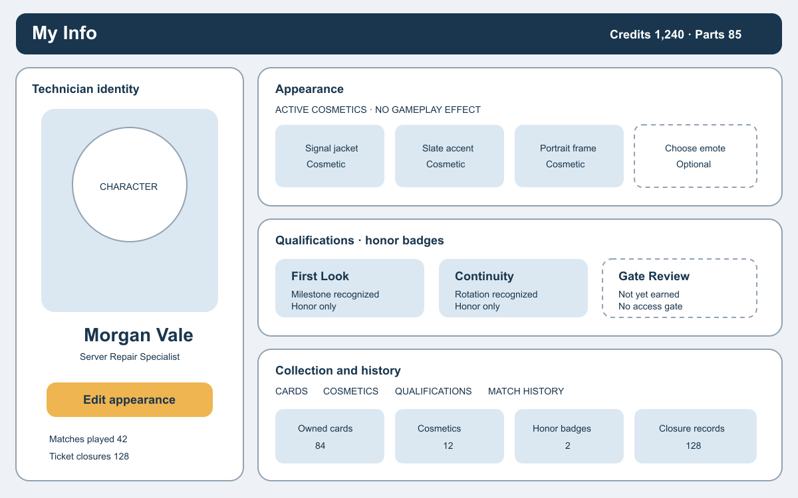
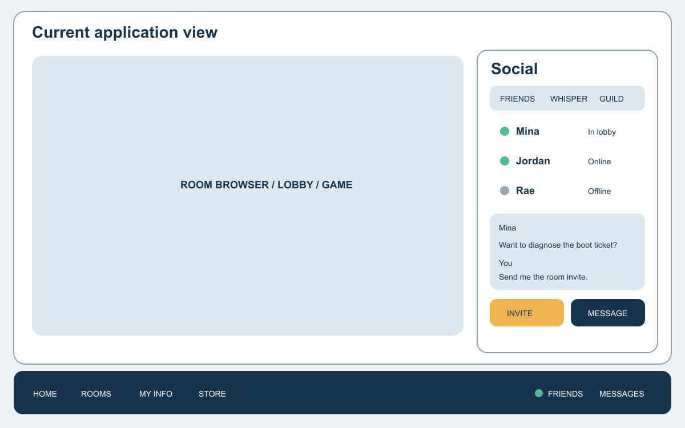
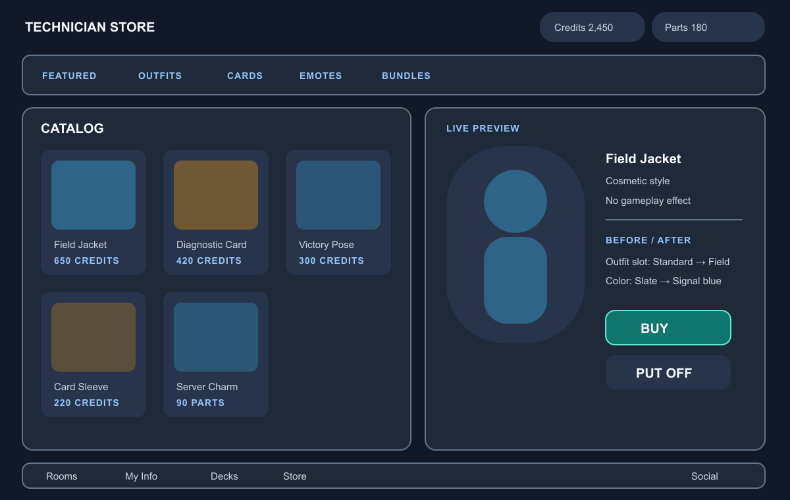
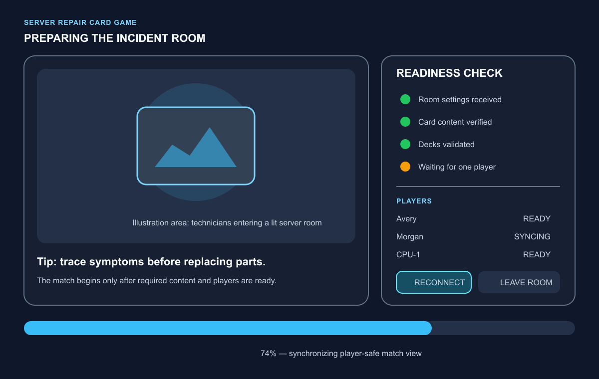

# UI Wireframe References

These are original, generalized wireframes derived from the supplied raw-reference notes and the working [`TODO.md`](../TODO.md). They preserve useful layout ideas without copying another game's artwork, characters, branding, or interface chrome.

The wireframes are intentionally low fidelity. They establish information hierarchy, reusable regions, and interaction intent. Colors, typography, illustration style, and final component geometry remain provisional.

## Reference map

| # | Concept | Primary future home |
|---|---|---|
| 1 | Persistent application shell | `01-application-shell/` |
| 2 | Social room browser | `02-room-browser/` |
| 3 | Friendly room creation | `03-room-creation/` |
| 4 | Presence-rich room lobby | `04-room-lobby/` |
| 5 | My Info, appearance, honor badges, collection, and history | `05-player-identity/` |
| 6 | Persistent friends, whispers, guilds, and invitations | `06-social/` |
| 7 | Store catalog with character preview | future commerce/store plan |
| 8 | Match loading and synchronization | room-to-match transition plan |

## 1. Application shell

[Editable SVG source](./01-application-shell.svg)

A stable top identity strip, replaceable central stage, persistent footer navigation, and an optional social drawer. Opening profile, store, rooms, or chat should not make the application feel like unrelated web pages.

## 2. Room browser

[Editable SVG source](./02-room-browser.svg)

Rooms communicate their emotional premise first—`COMPETITIVE` or `CO-OP`—with seats, team form, password state, and match availability as compact supporting facts. `Create room` remains prominent.

## 3. Room creation

[Editable SVG source](./03-room-creation.svg)

Illustrated presets reduce the feeling of a technical form. Essential choices stay visible; tuning variables belong behind an Advanced settings disclosure. Password protection and immediate player-seat selection are explicit.

## 4. Room lobby

[Editable SVG source](./04-room-lobby.svg)

A presence stage makes humans, computer players, open seats, teams, and readiness legible. Chat and primary room settings stay visible while detailed settings and host controls remain secondary.

## 5. My Info and character

[Editable SVG source](./05-my-info-and-character.svg)

The technician is the visual anchor. Cosmetic appearance, honor-only Qualifications, collection summaries, and performance history surround that identity. There is no account Equipment/loadout or mechanical ability-slot system; technical Tools remain cards/domain concepts rather than profile items.

## 6. Social dock

[Editable SVG source](./06-social-dock.svg)

Friends, whispers, guilds, private messages, room invitations, and presence share a persistent drawer reached from the application dock. Communication should survive navigation between rooms, My Info, decks, and the store.

## 7. Store

[Editable SVG source](./07-store.svg)

The catalog combines currency balances, category tabs, owned-card or cosmetic products, and a large live character preview for appearance items. Cosmetic purchases state that they have no gameplay effect; card purchases enter the collection rather than a character slot. `Put off` cleanly returns to browsing.

## 8. Loading and synchronization

[Editable SVG source](./08-loading-and-sync.svg)

The room-to-match transition is both an illustration opportunity and an honest readiness display. It distinguishes content checks, deck validation, player synchronization, reconnection, and leaving instead of presenting an unexplained spinner.

## How to use these references

- Treat each PNG preview and its SVG source as a structural study, not a pixel-perfect specification.
- Preserve the information hierarchy when creating later requirements and implementation contracts.
- Move or copy an approved wireframe into its eventual architecture folder only when that folder's boundary is frozen.
- Add source notes beside any future third-party reference. Keep third-party screenshots outside the public repository unless redistribution rights are clear.
- Prefer new original mockups for public architectural artifacts.
